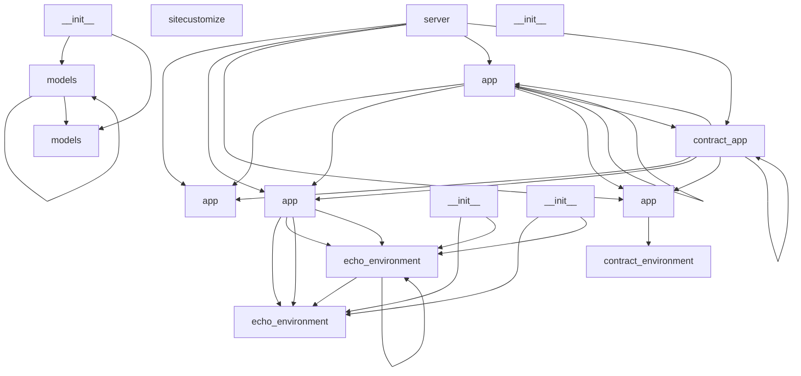
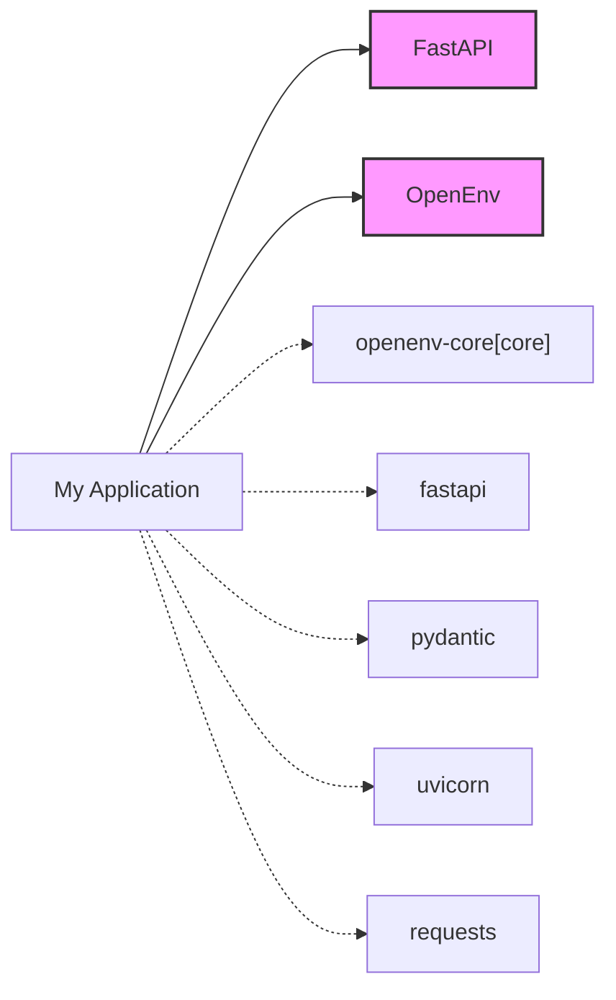

# Project Documentation

> **Auto-generated Repository Status:** _Updated on 2026-06-14 02:09:59_

## 📌 Project Overview
This repository uses the following core frameworks: FastAPI, OpenEnv

## 🏗️ System Architecture

### Component Map
Interactive view of internal modules and their relationships:

### Dependency Map

## 📦 Technology Stack
**Dependencies:**
- `openenv-core[core]`
- `fastapi`
- `pydantic`
- `uvicorn`
- `requests`

## 📂 Repository Structure
**Entrypoints:**
- `[source](app.py)`
- `[source](server.py)`
- `[source](src/echo_env/server/app.py)`
- `[source](src/contract_env/server/app.py)`
- `[source](server/app.py)`
- `[source](server/contract_app.py)`

## ⚙️ Environment Variables
No hardcoded env vars detected.

## 🚀 Setup & Deployment Instructions
1. Clone the repository
2. Install dependencies: `pip install -e .[dev]`
3. Run tests: `pytest`
4. Run application: `uv run --project . server`

## 🤝 Contribution Guide
- Review PRs via the AI Documentation Agent.
- Linting and formatting run automatically via GitHub Actions (black, flake8).
- Ensure your changes do not break the dependency maps.

---
*This README is continuously updated by repository automation.*
